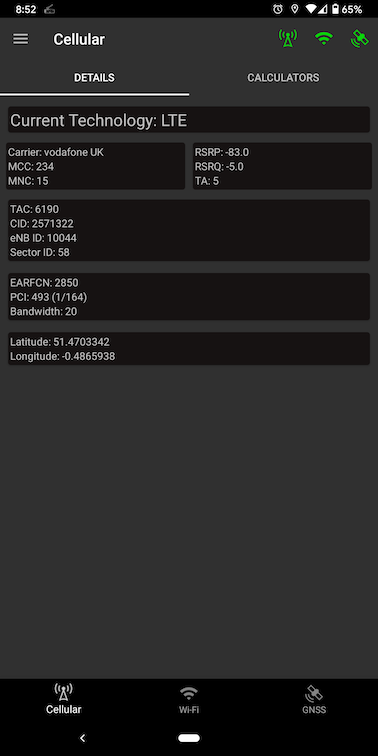
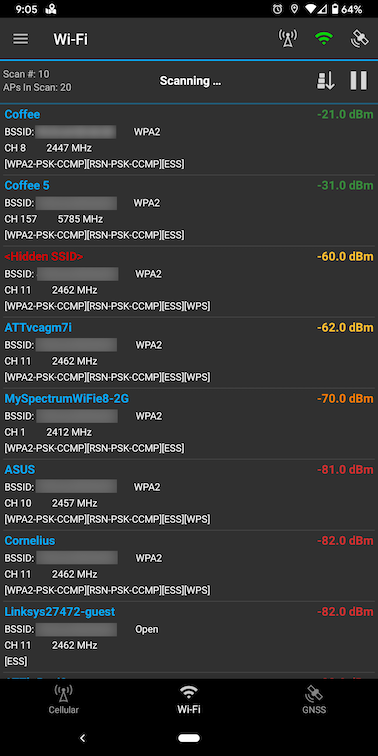

# Network Survey Android App

The Network Survey Android App provides a basic survey capability for Cellular networks, Wi-Fi networks and GNSS constellations.  
For cellular data, in its current state it can be used to examine the network details of the current LTE serving cell, and log 
GSM, CDMA, UMTS, and LTE records to a GeoPackage file. Wi-Fi survey records can also be logged to a GeoPackage file, 
and the current list of Wi-Fi networks in range is displayed in the UI. The App also supports connecting to a remote gRPC server and live 
streaming the cellular and Wi-Fi records. For GNSS data, it can display the latest information about the satellite vehicles and
also log the information to a GeoPackage file.

## Getting Started

To build and install the project follow the steps below:

    1) Clone the repo.
    2) Open Android Studio, and then open the root directory of the cloned repo.
    3) Connect an Android Phone (make sure debugging is enabled on the device).
    4) Install and run the app by clicking the "Play" button in Android Studio.

### Prerequisites

Install Android Studio to work on this code.

## Built With

* [GeoPackage Android](https://github.com/ngageoint/geopackage-android) - The logging file standard and library

## Available At

[The Google Play Listing for this app](https://play.google.com/store/apps/details?id=com.craxiom.networksurvey)

[IzzyOnDroid F-Droid](https://apt.izzysoft.de/fdroid/index/apk/com.craxiom.networksurvey)

## MQTT Broker Survey Record Streaming

Currently, GSM, CDMA, UMTS, LTE, and 802.11 survey records are sent to a connected MQTT broker. They
are published on the following MQTT Topics:

 * GSM_MESSAGE
 * CDMA_MESSAGE
 * UMTS_MESSAGE
 * LTE_MESSAGE
 * 80211_BEACON_MESSAGE
 
The MQTT Broker connection supports both plain text and TLS/SSL connections.

## Changelog

##### [0.1.2](https://github.com/christianrowlands/android-network-survey/releases/tag/release-0.1.2) - 2020-06-03
 * Wi-Fi beacon survey records can now be logged to a GeoPackage file, and sent over the connections
 * Added support for displaying the list of visible Wi-Fi networks
 * Improved the stability of the MQTT connection
 * The app's version number is now displayed in the navigation drawer

##### [0.1.1](https://github.com/christianrowlands/android-network-survey/releases/tag/release-0.1.1) - 2020-05-08
 * Added support for connecting to an MQTT broker and streaming cellular survey records
 * Added support for allowing the MQTT broker connection information to be set via MDM
 * Fixed a bug that caused the calculator text field to be covered on screens with low resolution and large font

##### [0.1.0](https://github.com/christianrowlands/android-network-survey/releases/tag/release-0.1.0) - 2020-03-24
 * Added support for logging GNSS information to a GeoPackage file

##### [0.0.9](https://github.com/christianrowlands/android-network-survey/releases/tag/release-0.0.9) - 2020-01-10
 * Moved the file logging and connection logic to foreground services to prevent the Android System from stopping them
 * The connection now supports sending GSM, CDMA, UMTS, and LTE survey records
 * Added a navigation drawer and put the calculators and connection in it
 * Added a settings UI
 * Other general improvements

## Contact

* **Christian Rowlands** - [Craxiom](https://github.com/christianrowlands)
